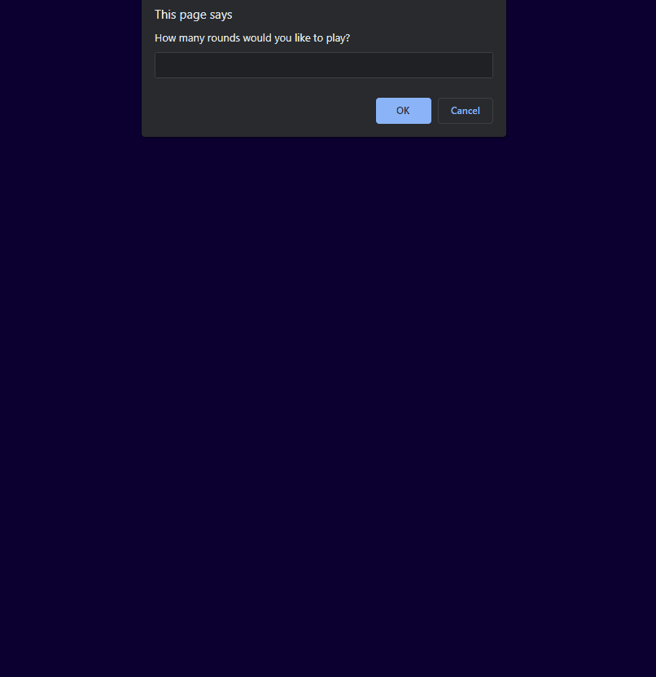

# Interactive Rock Paper Scissors

Fun way to play some Rock Paper Scissors with buttons you can press and interactive flashing when either player or "AI" takes damage. Game can be set to however long the player desires and ends once one playe reaches 0 health. Background music added for some fun and liven up the experience.

## Demo

  
## Lessons Learned

Practice, practice, practice. This was my first standalone experience translating some of what I learned in python to java with some extra flair thanks to html+css. I did A LOT of googling to figure out proper events and syntaxes to have the game function the way I wanted. Only downside was being unable to figure out how to have the background constantly changing color in a mood of celebration when player wins without interrupting the end game alert. Will revisit once I gain more experience/knowledge.
  
## Deployment

https://eccentricality.github.io/RPS/

  